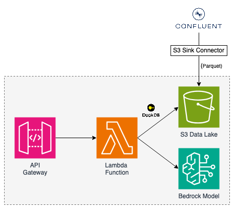

# About the Project

This project puts together a basic architecture for querying data captured in an event log (in this case Apache Kafka) using plain language. Queries are initiated by a REST API request, and run against an S3 data lake, populated by Confluent Cloud's Amazon S3 Sink Connector.

To keep things minimal, it all runs in a single container-based Lambda that:

- Invokes a Bedrock model to convert the user's question to raw SQL.
- Executes the query against the data lake using DuckDB.

While simple, this provides a proof-of-concept to allow natural language queries against large datasets with minimal cost.

## About the Data

The data in this project is the "NYC Citi Bike Trips" dataset provided by Google Cloud. There are two tables whose schemas are outlined [here](./run-query/schema.json) (this file is provided to the LLM). Users can ask questions about stations (e.g. availabilty, popularity, location) or trips (e.g. duration, user demographics).

# Built With

- [Confluent Cloud](https://www.confluent.io/confluent-cloud/)
- [SST (v3)](https://sst.dev/)
- [Go](https://go.dev/)
- [DuckDB](https://duckdb.org/)
- [Amazon API Gateway](https://aws.amazon.com/api-gateway/), [AWS Lambda](https://aws.amazon.com/lambda/), [Amazon S3](https://aws.amazon.com/s3/), [Amazon Bedrock](https://aws.amazon.com/bedrock/) (Claude 3.5 Sonnet V2).

# Architecture



# Example Usage

Here's what the API request looks like:

```bash
curl --location --request POST '<API_ENDPOINT>/question' \
--header 'Accept: application/json' \
--header 'Content-Type: application/json' \
--data-raw '{
    "question": "What are the 5 most popular stations to start a trip from?"
}'
```

And here's the response body for the provided question:

```json
[
  {
    "start_station_name": "8 Ave & W 31 St",
    "trip_count": 1766
  },
  {
    "start_station_name": "Pershing Square North",
    "trip_count": 1628
  },
  {
    "start_station_name": "W 21 St & 6 Ave",
    "trip_count": 1360
  },
  {
    "start_station_name": "Lafayette St & E 8 St",
    "trip_count": 1270
  },
  {
    "start_station_name": "E 17 St & Broadway",
    "trip_count": 1240
  }
]
```
